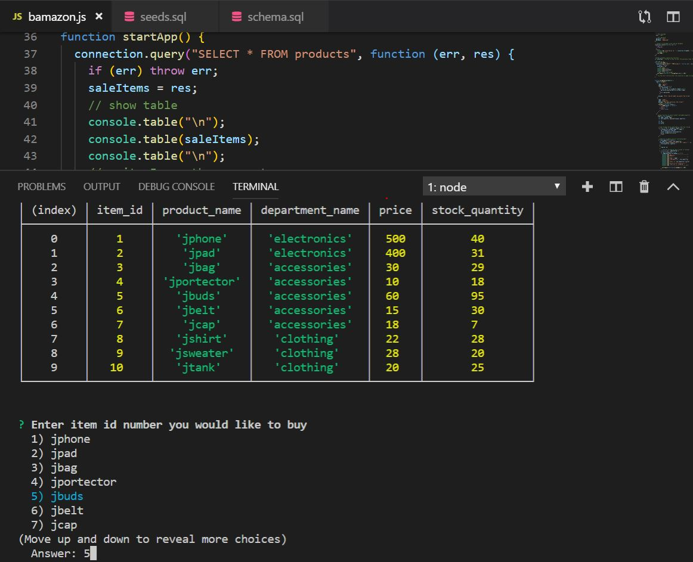
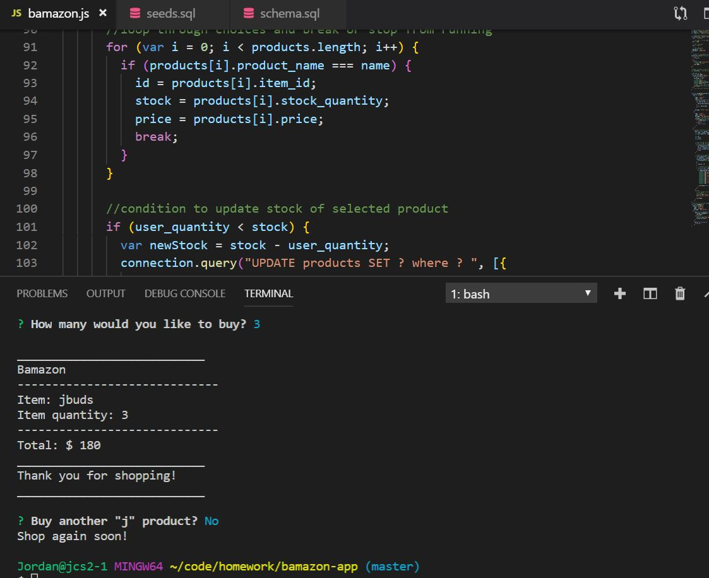

# bamazon-app
- An app that simulates an online store purchase.
+ node SQL and Inquirer modules
## How it works
- Connection to bamazon, and SQL database, will do a query on all "j" products available to purchase along with show their current price and stock quantity in a easy to use terminal display.
 

- After the table loads in the terminal, a user is prompt to select which product to purchase and then the quantity of the product they would like. The application allows selection from the number choices listed.
 

- Once bamazon checks to see the if there is quanitity avaiable, calculations are done to show  an order summary and the table stock quantity is updated.
 

- User finally is promopt with the choice to continue shopping or stop. 
### See demo
[Click here](https://drive.google.com/file/d/1m2W3lx-fubp5f1tYbx4_HDDhizAcGyuw/view)
[]https://drive.google.com/file/d/1m2W3lx-fubp5f1tYbx4_HDDhizAcGyuw/view
